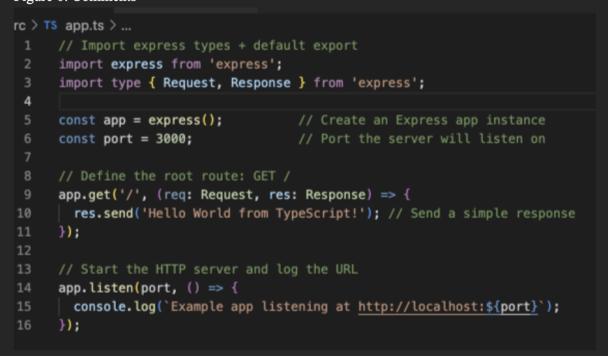

# Activity 0: Tools Installation and Initial Applications

- **Author**: Ian M. McConihay  
- **Course**: JavaScript Web Application Development  
- **Instructor**: Bobby Estey  
- **College**: College of Science, Engineering and Technology, Grand Canyon University  
- **Date**: September 7, 2025  

---

## Figure 1: Versions

- Terminal output confirming successful installation of **Node.js (v19.3.0)**.  
- Terminal output verifying **npm (v9.2.0)** is correctly installed alongside Node.js.

---

## Figure 2: NodeJS Hello World

- Execution of the **Node.js console application** (`app.js`) prints `Hello World!` in the terminal.  
- Confirms the Node.js runtime environment is functioning correctly.

---

## Figure 3: Node.js in Browser

- A **browser window** displays `Hello World!` served from the **Express application** at `http://localhost:3000`.  
- Confirms Express.js is correctly installed and responding to requests.

---

## Figure 4: Nodemon Auto-Reload

- The **Express server output** in the browser shows the updated response string.  
- The server was automatically reloaded by **Nodemon** after code changes, verifying dynamic development workflow support.

---

## Figure 5: TypeScript Message

- Browser displays: `Hello World from TypeScript!`  
- Served by a **TypeScript-based Express application**, confirming correct configuration of **TypeScript** and **ts-node**.

---

## Figure 6: Source Code Comments

- **VS Code editor** shows a fully-commented `app.ts` file.  
- Each line of the TypeScript/Express application is explained for clarity, aiding understanding and documentation.