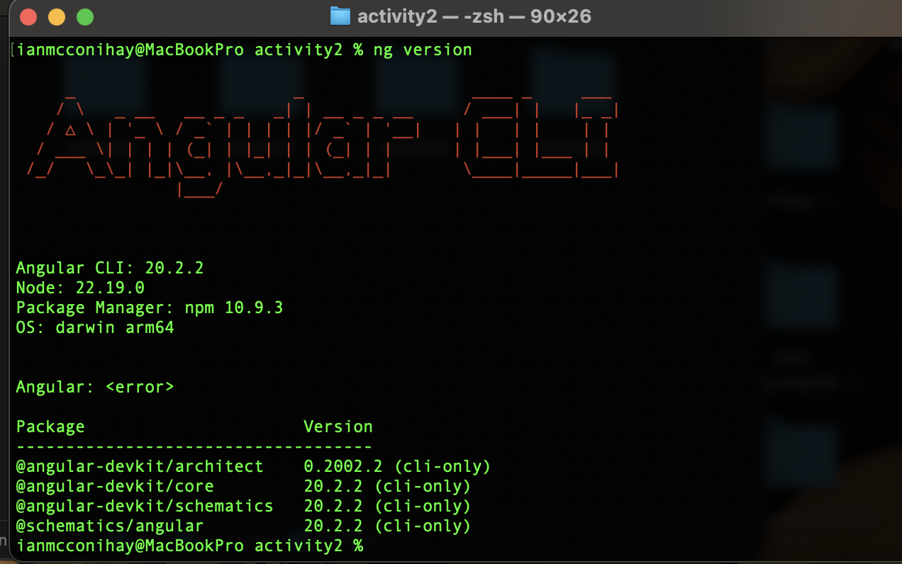
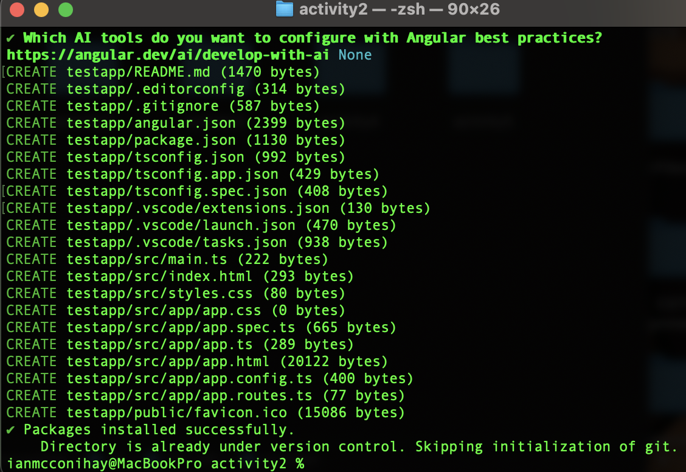
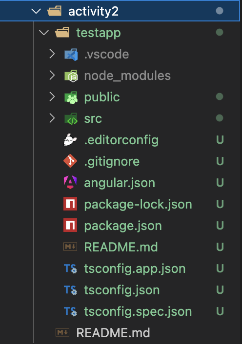
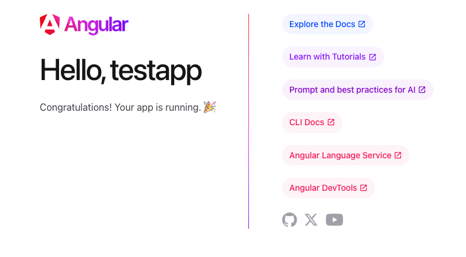
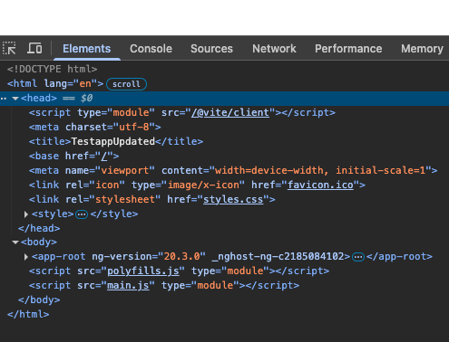
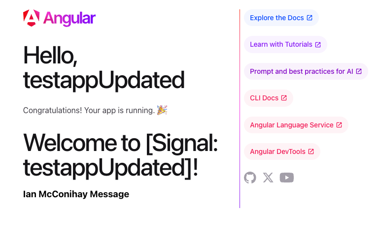

# Activity 2: Tools Installation and Angular Test App

- **Author**: Ian M. McConihay  
- **Course**: JavaScript Web Application Development  
- **Instructor**: Bobby Estey  
- **College**: College of Science, Engineering and Technology, Grand Canyon University  
- **Date**: September 14 2025  

---

## Part 1: Tools Installation

### Figure 1: Angular CLI Installation
### Figure 2: Angular CLI Version
  
- Screenshot confirming Angular CLI version with `ng version`.  
- Screenshot of the terminal showing successful installation of Angular CLI.  

## Part 2: Angular App

### Figure 3: Create Angular Test Application
  
- Screenshot of the command `ng new testapp` with Angular routing enabled and CSS selected.  

### Figure 4: VS Code Workspace Setup
  
- Screenshot of VS Code with the `testapp` folder set as the workspace.  

### Figure 5: Angular App Running in Browser
  
- Screenshot of the browser showing the default Angular starter page after running `ng serve -o`.  

### Figure 6: Update Title Variable
  
- Screenshot of updated **title** variable in `app.component.ts`.  
- Browser refresh confirms the new title is rendered automatically.  

### Figure 7: Add Message Variable
  
- Screenshot showing new **message** variable added to `app.component.ts`.  
- The message is displayed inside an `<h3>` element in the template.  

---

## Part 3: Research

### Project Structure

- **node_modules**: Stores all external libraries and dependencies installed via npm.  
- **src**: Root source folder containing the application code.  
- **src/app**: Main application logic, including components, modules, and services.  
- **src/assets**: Static files such as images, styles, or JSON data.  
- **src/environments**: Holds configuration files for different environments (dev, prod).  

- **angular.json**: Main Angular CLI configuration file (build settings, assets, styles).  
- **package.json**: Manages dependencies, npm scripts, and project metadata.  
- **tsconfig.json**: TypeScript configuration, including compiler options and paths.  

### Page Source and Angular Files

- **main.ts**: Entry point of the Angular application; bootstraps the root module (`AppModule`).  
- **app.component.css**: Defines styles applied only to the `AppComponent`.  
- **app.component.html**: Template file defining the HTML structure for the component.  
- **app.component.ts**: TypeScript logic for the component; contains properties like `title` and `message`.  
- **app.module.ts**: Root Angular module; declares components and imports other modules.  

---