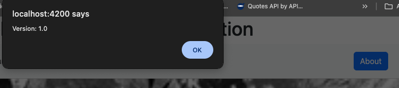

# Activity 3: Angular Music App Fixed Data

- **Author**: Ian M. McConihay  
- **Course**: JavaScript Web Application Development  
- **Instructor**: Bobby Estey  
- **College**: College of Science, Engineering and Technology, Grand Canyon University  
- **Date**: September 21 2025  

---
PART 1
## Screenshots

**Small Screen**  


**Large Screen**  


**Before Name**  


**After Name**  


**Browser Name Entered**  


---

## Research
1. @Input Decorator in info.component.ts
---------------------------------------

The `@Input` decorator in Angular is used to pass data from a parent component into a child component.  
It allows a child component (e.g., `info.component.ts`) to receive values defined in the parent template.  
This is especially useful for creating reusable components where the content can vary.

**Example in info.component.ts:**

```ts
import { Component, Input } from '@angular/core';

@Component({
  selector: 'app-info',
  templateUrl: './info.component.html'
})
export class InfoComponent {
  @Input() message: string = '';
}
```

**Usage in parent template:**

```html
<app-info [message]="'Hello from parent!'"></app-info>
```

This would display “Hello from parent!” inside the `InfoComponent`.

---

2. [value] in info.component.html
---------------------------------

The `[value]` binding is Angular’s property binding syntax.  
It sets the `value` property of an HTML element dynamically based on the component’s property.  
This is a **one-way binding**, meaning changes in the component reflect in the DOM, but not vice versa.

**Example in info.component.html:**

```html
<input [value]="username">
```

**In info.component.ts:**

```ts
export class InfoComponent {
  username: string = 'JohnDoe';
}
```

This will render an input field with the value “JohnDoe” pre-filled.

---

3. [(ngModel)] in info.component.html
-------------------------------------

The `[(ngModel)]` syntax enables **two-way data binding**,  
meaning that changes in the UI will update the component property and vice versa.  
This is useful in form inputs where you want to keep the input value in sync with your component class.

**Example in info.component.html:**

```html
<input [(ngModel)]="email">
<p>Your email: {{ email }}</p>
```

**In info.component.ts:**

```ts
export class InfoComponent {
  email: string = '';
}
```

Typing into the input field updates the `email` property and the paragraph below it in real time.

## Part 2: Creating a Music Application – The Front End

In this activity, the goal was to build the front end for a Music application using Angular. The application implements multiple components, handles page events, and binds data to a view template. Mock JSON data and album images were used to simulate backend API responses.

---

### Key Features Implemented

1. **Angular Project Setup**
   - Created a new Angular project called `musicapp` with routing enabled.
   - Added Bootstrap and Popper for responsive styling and navigation.

2. **Data Integration**
   - Added a `data` folder under `src/` and imported `sample-music-data.json`.
   - Enabled JSON imports with:
     ```json
     "resolveJsonModule": true,
     "esModuleInterop": true
     ```
     inside `tsconfig.app.json`.

3. **Components**
   - Generated and configured the following:
     - `list-artists`
     - `list-albums`
     - `create-album`
     - `display-album`
     - `edit-album`
     - `delete-album`
   - Each component mapped to a route via `app.routes.ts`.

4. **Navigation**
   - Implemented a Bootstrap NavBar with router-based navigation:
     - **My Music** (brand, routes to `/`)
     - **GCU Home Page** (external link to [https://www.gcu.edu](https://www.gcu.edu))
     - **Create Album** (`/create`)
     - **Artist List** (wired to route with placeholder alert for now)
     - **About** (displays version via `displayVersion()`)

5. **Music Service**
   - Created `music-service.service.ts` to act as a façade for accessing albums and artists.
   - Implemented methods for:
     - `getArtists()`
     - `getAlbums(artist?: string)`
     - `getAlbum(artist: string, id: number)`
     - `createAlbum(album: Album)`
     - `updateAlbum(album: Album)`
     - `deleteAlbum(id: number, artist: string)`
   - Data bound to the UI via Angular service injection.

6. **Album Create Component**
   - UI implemented to add new albums.
   - Submits form data to `MusicServiceService.createAlbum()`.
   - Updates artist/album lists dynamically after creation.

---

### Optional Features (Planned / In Progress)
- **Album Update Component**  
  Plan: reuse the CreateAlbumComponent as a child component for editing.  

- **Album Delete Component**  
  Plan: implement deletion confirmation and integrate with `MusicServiceService.deleteAlbum()`.  

---

## Research Section

### Fully Commented Music Service
The file `music-service.service.ts` was annotated with comments explaining:
- [Music Service Source Code](https://github.com/YourUsername/YourRepo/blob/main/src/app/service/music-service.service.ts)
- Purpose of each method.
- How mock JSON is loaded and used like a backend API.
- Error handling strategy for create, update, and delete operations.

---


## Deliverables

### Figure 1: Initial Application Page
  
- Screenshot of the default landing page of the music application.  

### Figure 2: GCU Home Page
  
- Screenshot showing successful navigation to the GCU website from the navbar.  

### Figure 3: Create Album Page
  
- Screenshot of the Create Album form with fields for adding a new album.  

### Figure 4: Artist List Page
  
- Screenshot showing the list of available artists pulled from the mock JSON data.  

### Figure 5: Album Details Page
  
- Screenshot of the details view for a selected album.  

### Figure 6: About Box
  
- Screenshot of the "About" button triggering a version alert box.  

### Figure 7: My Created Album
  
- Screenshot confirming that the new album added via the form appears in the album list.  