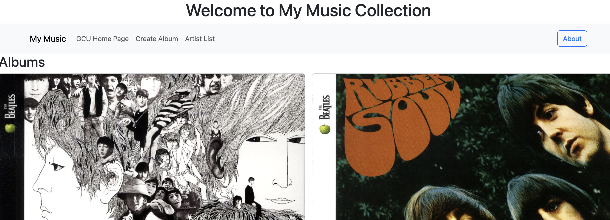
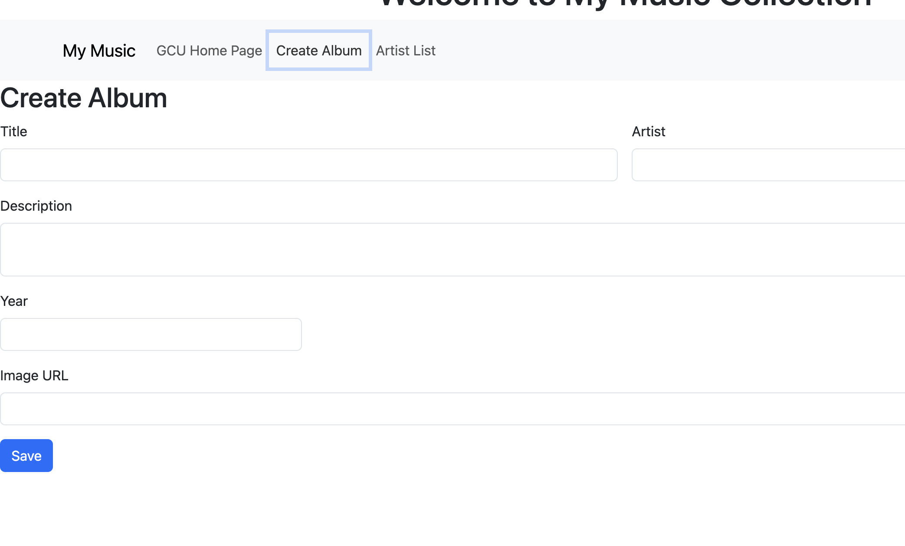
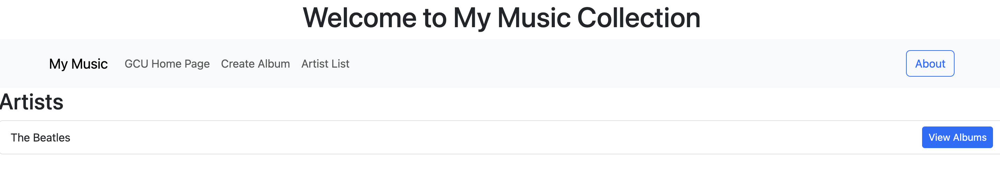
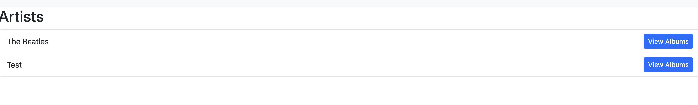
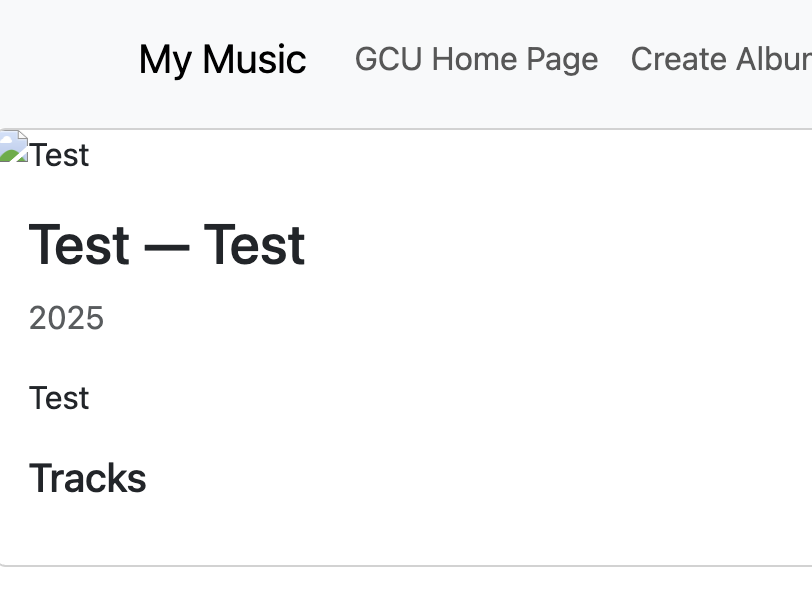

# Activity 4: Angular Music App with Backend Integration

- **Author**: Ian M. McConihay  
- **Course**: JavaScript Web Application Development  
- **Instructor**: Bobby Estey  
- **College**: College of Science, Engineering and Technology, Grand Canyon University  
- **Date**: September 28 2025  

---

## Overview

In this activity, the Music application was extended to integrate with the backend **Express MusicAPI** created in Topic 1.  
Instead of relying on hard-coded JSON data, the Angular front end now communicates with the API over HTTP,  
retrieving live data for artists and albums and supporting full **CRUD operations** (Create, Read, Update, Delete).  

---

## Steps Completed

1. **Workspace Setup**
   - Created a copy of the `musicapp` directory from Activity 3 into a new Activity 4 workspace.  
   - Configured Angular project to run with `ng serve -o`.  
   - Backend (`MusicAPI`) was run separately using Node.js and Express.

2. **HttpClient Integration**
   - Imported `HttpClientModule` into the app configuration.  
   - Replaced the JSON-based `MusicServiceService` with an HTTP-based service.  
   - Base URL set to: `http://localhost:5050`.

3. **Refactored Music Service**
   - All service methods updated to return **Observables** instead of static arrays:
     - `getArtists()`
     - `getAlbums(artist?: string)`
     - `getAlbum(artist: string, id: number)`
     - `createAlbum(album: Album)`
     - `updateAlbum(album: Album)`
     - `deleteAlbum(id: number, artist: string)`

4. **Component Updates**
   - Components updated to **subscribe** to service calls instead of using synchronous data.  
   - Example: `list-artists` now calls `this.service.getArtists().subscribe(...)`.  
   - `create-album` posts new albums to the backend and navigates to the artist list upon success.  

5. **CORS + Middleware**
   - Added `cors` and `helmet` middleware in the Express backend.  
   - Ensured cross-origin requests from Angular (`localhost:4200`) are permitted.  

---

## Screenshots

### Figure 1: Albums List
  
- Screenshot of the Albums list populated from the backend API.  

### Figure 2: Create Album Form
  
- Screenshot of the Create Album form before submission.  

### Figure 3: Artists List
  
- Screenshot of the Artists list, now powered by backend API data.  

### Figure 4: Newly Created Album
  
- Screenshot confirming a new album was successfully created.  

### Figure 5: New Album Details
  
- Screenshot showing the detail view for the newly added album.  

---

## Research

**How does an Angular application maintain a logged-in state and communicate it to the server?**

Angular applications typically manage login state using **tokens** (often JSON Web Tokens — JWTs).  
- After successful authentication, the backend issues a signed token.  
- Angular stores this token in memory, session storage, or local storage.  
- Every subsequent HTTP request to the backend includes the token, usually in the `Authorization` header (`Bearer <token>`).  
- The backend verifies the token to confirm the user’s identity and permissions.  

This method is stateless — the server does not need to remember sessions, as all authentication information is encoded in the token.  

---