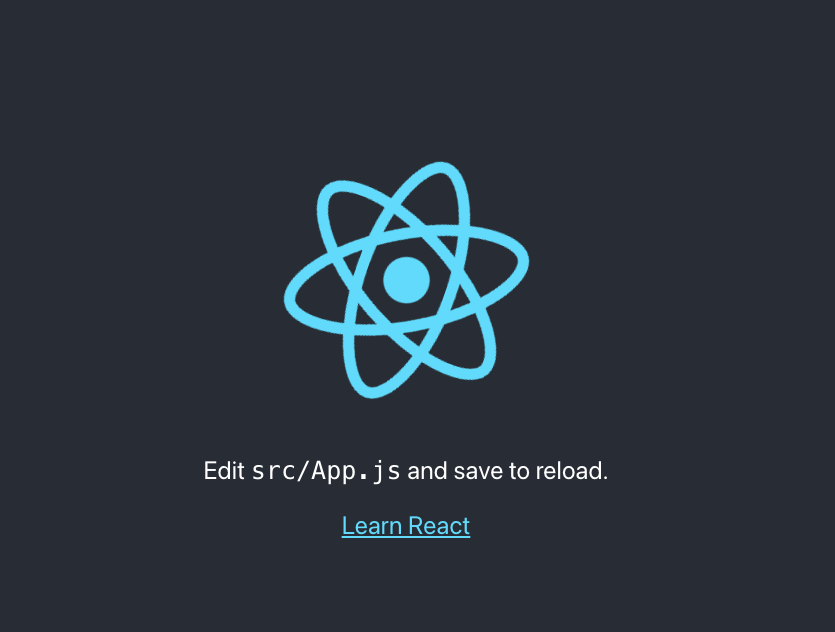
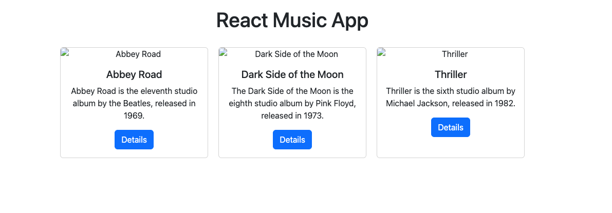
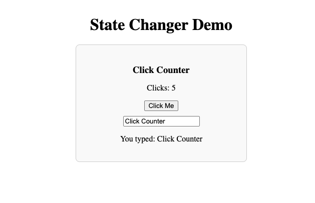
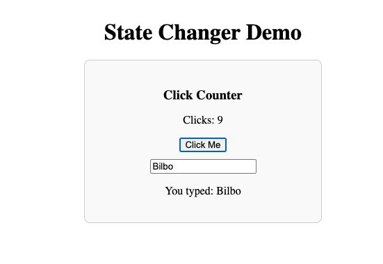

# Activity 5: React Music App with Props and State

- **Author**: Ian M. McConihay  
- **Course**: JavaScript Web Application Development  
- **Instructor**: Bobby Estey  
- **College**: College of Science, Engineering and Technology, Grand Canyon University  
- **Date**: October 05 2025  

---

## Summary

In this activity, we transitioned from Angular to **React** to begin building the Music App using **JSX, props, and state**. React introduced a new way to structure UI components, requiring a single parent element and JSX syntax adjustments such as `className` instead of `class`.  

We modularized the application by creating a reusable **Card component** that receives data through props, reducing repetition in the code. Each Card can now display its own album title, description, image, and button text. We also used the **map() function** to dynamically render multiple cards from an array, making the code flexible and scalable.  

Additionally, we applied **Bootstrap styling** and custom CSS to enhance the layout using FlexBox, making the album cards render horizontally with proper spacing.  

A separate **StateChanger mini app** demonstrated how React components manage dynamic state using the `useState` hook. This highlighted how state responds to user events such as clicks and keystrokes, and reinforced the difference between **props (data passed from parent components)** and **state (data managed within the component itself)**.

---

## Screenshots

### Figure 1: React App – Initial View
  
- Screenshot of the initial React app rendering successfully at `localhost:3000`.  

### Figure 2: React Music App – Album Cards  
  
- Screenshot of the React Music App displaying multiple albums as Bootstrap cards using props.  

### Figure 3: StateChanger Demo – Initial View  
  
- Screenshot of the StateChanger mini app showing the default state.  

### Figure 4: StateChanger Demo – After Clicks and Input  
  
- Screenshot of the StateChanger mini app after incrementing the click counter and typing input text, demonstrating live state updates.  

---

## Conclusion

Activity 5 provided the foundation of React development by focusing on **props for reusability** and **state for dynamic behavior**. The Music App now has modular components capable of rendering multiple albums with clean, reusable code.  

The **StateChanger demo** reinforced how React’s `useState` hook updates the UI in real time, demonstrating that state changes ripple outward to re-render affected components.  

This activity established key patterns—props, state, and component composition that will support future enhancements such as pulling album data from external sources and building more interactive features in the Music App.

---