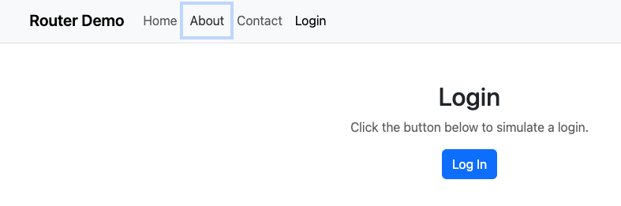

# Activity 6: React Music App – External Data and Routing

- **Author**: Ian M. McConihay  
- **Course**: JavaScript Web Application Development  
- **Instructor**: Bobby Estey  
- **College**: College of Science, Engineering and Technology, Grand Canyon University  
- **Date**: October 12 2025  

---

## Summary

In **Activity 6**, I built on the previous React Music App by introducing **external data sources**, **REST integration**, and **application routing**.  
This project showcased how to use React Hooks (`useState`, `useEffect`, `useMemo`) and React Router v6 for multi-page navigation and dynamic data handling.  

The activity was divided into two parts:
1. **Mini App #2 – Routing Application Demo**  
   Demonstrated secure routing, protected routes, and login handling using React Router.
2. **Music Application – External Data and Routing**  
   Enhanced the main React Music App to load albums from JSON and the backend API, with working routes for search, details, and add album. My css is a little different and my version of React but its all of the same material. 

---

## Mini App #2 – Routing Application Demo

| Screenshot | Description |
|-------------|-------------|
|  | Default landing page for the routing demo, showing initial route rendering. |
|  | Attempting to access a protected route while **not logged in** redirects to the login page. |
|  | After logging in, the **About** page is accessible, confirming protected routing works. |
|  | The **Contact Us** page displays once authenticated, verifying route navigation and state persistence. |

### Key Concepts Learned
- Implementing **React Router v6**  
- Creating **PrivateRoute** components for protected navigation  
- Handling authentication state (`useState`, `useNavigate`)  
- Using Bootstrap for layout and styling of routes and navbars  

---

## Stage 1 – External Data Source (Part 3)

| Screenshot | Description |
|-------------|-------------|
|  | Displays the initial list of albums loaded from the local `albums.json` file before integrating the API. |
|  | Console output confirming that `useEffect()` successfully fetched and set album data. |
|  | Shows the debug messages (“No match for: …”) in the console when the search term doesn’t match any album entry. |
|  | Displays the filtered album list after a search term is entered, confirming the search callback and filtering logic work correctly. |

### Key Concepts Learned
- Using `useEffect()` for side effects and data fetching  
- Loading JSON data dynamically into state via `setAlbumList()`  
- Filtering data efficiently with `useMemo()`  
- Debugging state updates with console logs  
- Understanding React’s component lifecycle when external data changes  

---

## Stage 2 – Navigation Routing (Part 4)

| Screenshot | Description |
|-------------|-------------|
|  | Displays the **Add Album** navigation tab and placeholder page (`/new`), confirming route setup and navigation. |
|  | Shows the **Album Details** page (`/show/:albumId`), verifying dynamic routing and parameter passing. |
|  | Demonstrates albums loaded from the backend database via the REST API, showing full data integration. |

### Key Concepts Learned
- Implementing routing with `BrowserRouter`, `Routes`, and `Route`  
- Creating navigation with a reusable **NavBar** component  
- Passing props through routed components (`SearchAlbum`, `AlbumList`, `Card`)  
- Using `useNavigate()` for programmatic routing  
- Maintaining search state and filtering across routes  

---

## Conclusion

Activity 6 successfully combined **React Hooks**, **REST API data**, and **routing** to create a scalable, interactive web application.  
The mini app demonstrated secure navigation patterns, while the Music App connected to dynamic data sources and provided responsive routing between components.  
These skills form the backbone for the next activity, where CRUD operations and deeper API integration will bring the Music App closer to a full-stack production system.

---