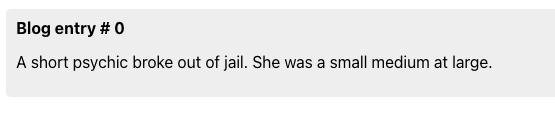
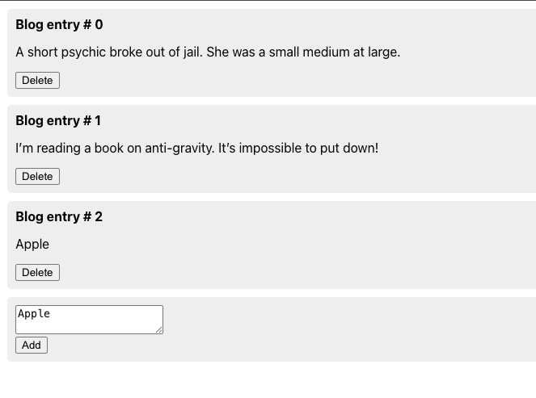
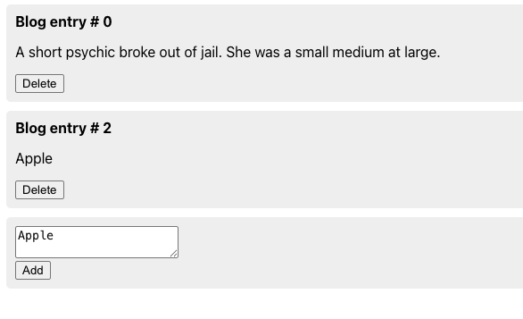
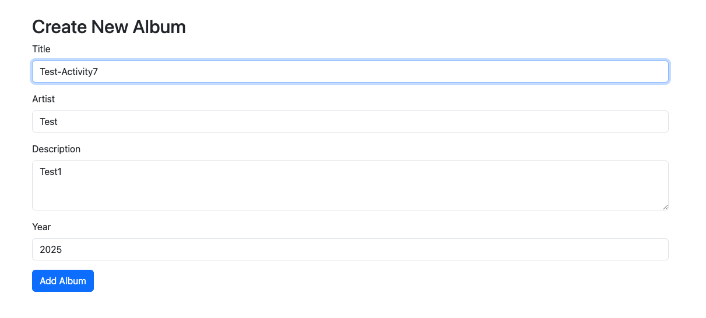
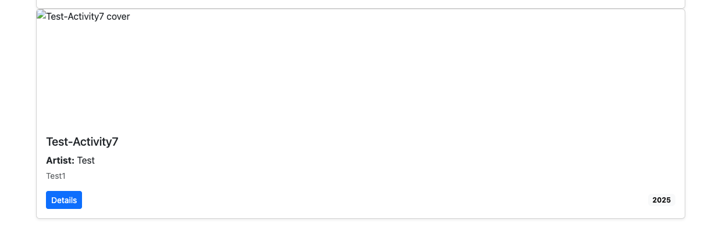
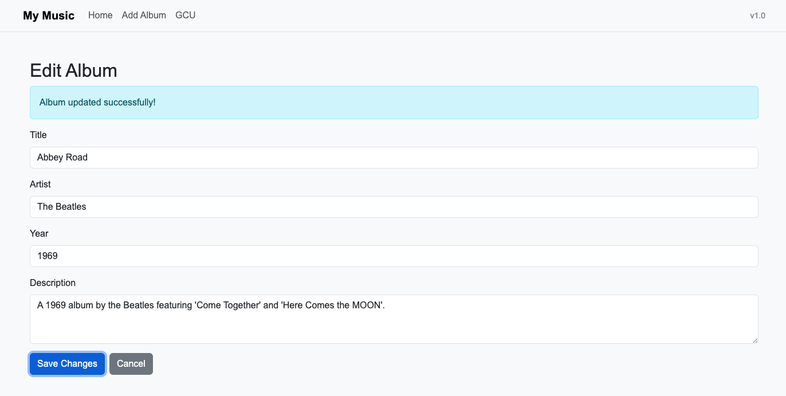
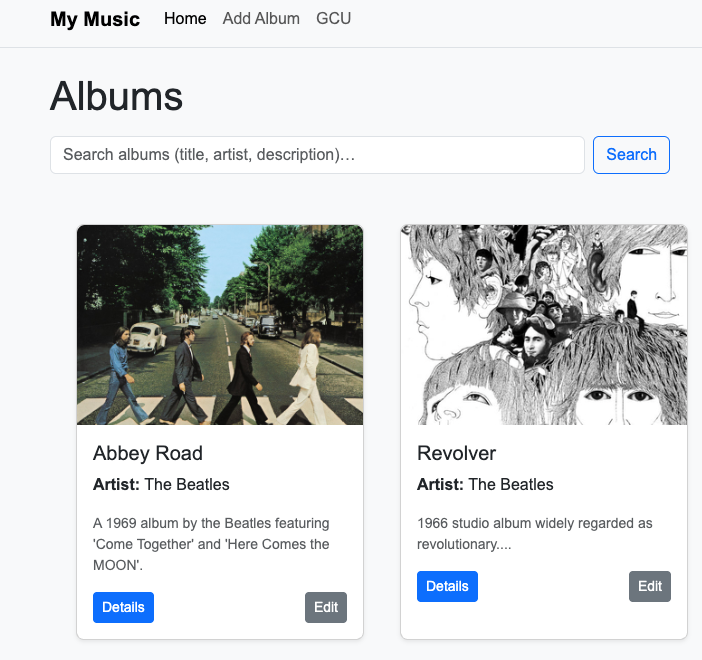

# CST-391 Activity 7 – Dynamic Components and Music App

**Author**: Ian M. McConihay  
**Course**: JavaScript Web Application Development  
**Instructor**: Bobby Estey  
**College**: College of Science, Engineering and Technology, Grand Canyon University  
**Date**: October 19 2025  

---

## Overview
In Activity 7, I implemented dynamic components through a mini blog app and extended the React Music Application with new album creation, album editing, and enhanced UI styling. The blog mini app demonstrated how to add and delete posts dynamically using useState, controlled components, and props with callbacks. In the music app, I built a New Album form, expanded it into an Edit Album form, and ensured albums could be updated in the state. I also added custom CSS improvements for cleaner card layouts and button styling. Additionally, I completed three of the optional “Unfinished Business” features: updating the album list after edits, automatic navigation back to the main screen, and a cancel button for the edit form. These enhancements showcase deeper use of React state management, event handling, and component composition.

---

## Mini App #3 – Blog Demo

Demonstrates adding and deleting blog posts dynamically.

### Screenshots
  
*Figure 1: Blog posts initially rendered.*

  
*Figure 2: New blog post added dynamically.*

  
*Figure 3: Blog post deleted from the list.*

---

## Music App – New Album Form

A controlled form built with Bootstrap was added to create new albums. Inputs are tied to `useState`, and on submission, the album is appended to the list.

### Screenshots
  
*Figure 4: Controlled form for creating a new album.*

  
*Figure 5: Album list updated after adding a new album.*

---

## Music App – Edit Album

The Edit Album feature reuses the same form as New Album but pre-populates fields with existing album data. Submitting updates the album in the list.

### Screenshots
  
*Figure 6: Album form populated for editing.*

  
*Figure 7: Album successfully updated.*

---

## Demo Video
<video src="images/music/App-Demo.mp4" controls width="600"></video>
*Click the thumbnail above to view the walkthrough of the music app features.*

---

## Conclusion
Overall, Activity 7 highlighted React’s dynamic component model and reinforced how controlled components, hooks, and navigation work together in a multi-page app. The blog mini app provided practice with dynamic lists, while the music app gained critical features including adding new albums, editing existing ones, updating album state, and improved UI formatting. By implementing three of the optional challenges and introducing custom CSS refinements, I pushed the application beyond the minimum requirements and demonstrated practical skills in building interactive and user-friendly React applications.
