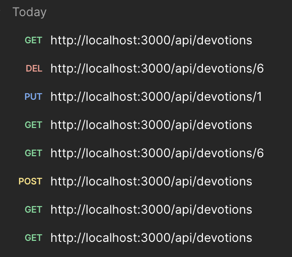

## Milestone 3: Daily Devotional Tracker 
### Ian M. McConihay
College of Science, Engineering and Technology, Grand Canyon University 
JavaScript Web Application Development    
Instructor: Bobby Estey 
Sept 14 2025

---

## Project Overview

- Full-stack web application
- REST API (Express.js + TypeScript)
- MySQL database
- Supports CRUD for "Devotions"
- Angular and React frontends planned

---

## REST API Endpoints

| Method | Endpoint              | Purpose                  |
|--------|-----------------------|--------------------------|
| GET    | `/api/devotions`      | Fetch all devotionals    |
| GET    | `/api/devotions/:id`  | Get devotional by ID     |
| POST   | `/api/devotions`      | Create new devotional    |
| PUT    | `/api/devotions/:id`  | Update devotional        |
| DELETE | `/api/devotions/:id`  | Delete devotional        |

---

## Design Updates

| Update Area       | Description |
|-------------------|-------------|
| Language Shift    | All logic written in TypeScript |
| New Structure     | `controllers/`, `routes/`, `models/`, `database/` |
| SQL Integration   | Added MySQL connection with `mysql2/promise` |
| Config Security   | Used `.env` for DB credentials |

---

## Sample Devotion Model (TypeScript)

```ts
export interface Devotion {
  id?: number;
  title: string;
  content: string;
  date: string;
}
```

---

## Postman Testing (Preview)

- All CRUD endpoints tested in Postman


---

## MySQL Table Setup

```sql
CREATE TABLE devotions (
  id INT AUTO_INCREMENT PRIMARY KEY,
  title VARCHAR(255) NOT NULL,
  content TEXT NOT NULL,
  date DATE NOT NULL,
  created_at TIMESTAMP DEFAULT CURRENT_TIMESTAMP
);
```

---

## Demo Sample Insert

```sql
INSERT INTO devotions (title, content, date)
VALUES
  ('Morning Prayer', 'Thankful for new beginnings.', '2025-09-01'),
  ('Psalm 23 Reflection', 'The Lord is my shepherd...', '2025-09-02'),
  ('Evening Gratitude', 'Peaceful end to the day.', '2025-09-03');
```

---

## Challenges Encountered

- Node + TypeScript config (`tsconfig`, `nodemon`, etc.)
- Environment variable management
- MySQL connection pooling
- Organizing folder structure for clarity

---

## Known Issues

| Issue                         | Status    |
|------------------------------|-----------|
| Auth system                  | To be added in later milestone |
| Deployment                   | Not yet deployed to cloud |

---

## Lessons Learned

- Type safety with TypeScript boosts confidence
- REST API organization is crucial for scalability
- `.env` and modular architecture help maintainability
- Postman helps visualize and debug endpoints quickly

---

## Demo Instructions

1. Start MySQL and run table DDL
2. Run `npm install`
3. Start server with `npm run dev`
4. Test all routes in Postman
5. Observe database changes in MySQL Workbench

---

## Resources

- GitHub: **https://github.com/Ian-McConihay/CST-391/blob/main/milestones/milestone3/README.md**
- Screencast: **[Watch on Loom](https://www.loom.com/share/094153bf966848e285de247a24c1e871?sid=8d021144-639b-4ca3-a985-6a7ed2f0ef05)**

---

## Thank You!

**Milestone 3: Backend REST API Complete**  
Frontend integration and security coming soon.