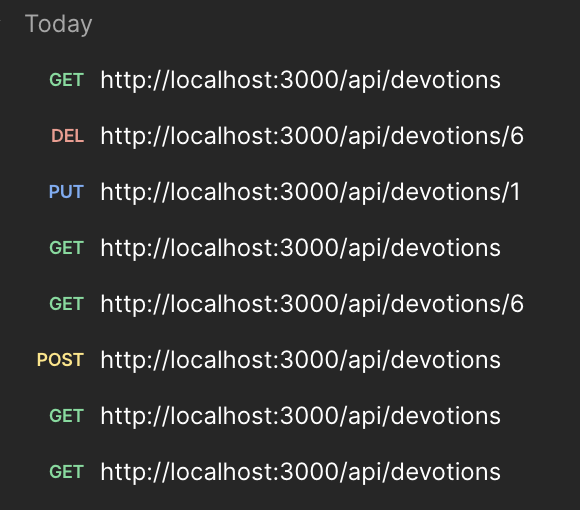

## Milestone 6: Presentation
### Ian M. McConihay  
College of Science, Engineering and Technology, Grand Canyon University  
JavaScript Web Application Development  
Instructor: Bobby Estey  
October 26, 2025

---

## Milestone 3: Daily Devotional Tracker 
### Ian M. McConihay  
Sept 14, 2025

---
## Project Overview

- Full-stack web application  
- REST API (Express.js + TypeScript)  
- MySQL database  
- Supports CRUD for "Devotions"  
- Angular and React frontends planned

---

## REST API Endpoints

| Method | Endpoint              | Purpose                  |
|--------|-----------------------|--------------------------|
| GET    | `/api/devotions`      | Fetch all devotionals    |
| GET    | `/api/devotions/:id`  | Get devotional by ID     |
| POST   | `/api/devotions`      | Create new devotional    |
| PUT    | `/api/devotions/:id`  | Update devotional        |
| DELETE | `/api/devotions/:id`  | Delete devotional        |

---

## Design Updates

| Update Area       | Description |
|-------------------|-------------|
| Language Shift    | All logic written in TypeScript |
| New Structure     | `controllers/`, `routes/`, `models/`, `database/` |
| SQL Integration   | Added MySQL connection with `mysql2/promise` |
| Config Security   | Used `.env` for DB credentials |

---

## Sample Devotion Model (TypeScript)

```ts
export interface Devotion {
  id?: number;
  title: string;
  content: string;
  date: string;
}
```

---

## Postman Testing (Preview)

All CRUD endpoints tested in Postman  



---

## MySQL Table Setup

```sql
CREATE TABLE devotions (
  id INT AUTO_INCREMENT PRIMARY KEY,
  title VARCHAR(255) NOT NULL,
  content TEXT NOT NULL,
  date DATE NOT NULL,
  created_at TIMESTAMP DEFAULT CURRENT_TIMESTAMP
);
```

---

## Demo Sample Insert

```sql
INSERT INTO devotions (title, content, date)
VALUES
  ('Morning Prayer', 'Thankful for new beginnings.', '2025-09-01'),
  ('Psalm 23 Reflection', 'The Lord is my shepherd...', '2025-09-02'),
  ('Evening Gratitude', 'Peaceful end to the day.', '2025-09-03');
```

---

## Challenges Encountered

- Node + TypeScript config (`tsconfig`, `nodemon`, etc.)  
- Environment variable management  
- MySQL connection pooling  
- Organizing folder structure for clarity

---

## Known Issues

| Issue                         | Status    |
|------------------------------|-----------|
| Auth system                  | To be added in later milestone |
| Deployment                   | Not yet deployed to cloud |

---

## Lessons Learned

- Type safety with TypeScript boosts confidence  
- REST API organization is crucial for scalability  
- `.env` and modular architecture help maintainability  
- Postman helps visualize and debug endpoints quickly

---

## Milestone 4: Daily Devotional Tracker (Angular Frontend)  
### Ian M. McConihay  
Sept 28, 2025

---

## Project Overview

- Full-stack web application  
- REST API (Express.js + TypeScript)  
- MySQL database  
- Angular frontend implementing CRUD for "Devotions"  
- Bootstrap navigation and responsive UI

---

## Angular + REST Integration

| Feature        | Description                                  |
|----------------|----------------------------------------------|
| List Devotions | Angular `DevotionListComponent` fetches data |
| Create/Edit    | `DevotionFormComponent` posts/puts to API    |
| Delete         | Delete buttons call API and refresh list     |
| Routing        | `/devotion` and `/devotion/new` routes       |

---

## Design Updates

| Update Area          | Description |
|----------------------|-------------|
| Angular UI Scaffold  | `DevotionListComponent` + `DevotionFormComponent` |
| Service Layer        | Created `DevotionService` using HttpClient |
| Bootstrap Styling    | Responsive NavBar + tables |
| Routing              | Angular routes for list/create/edit |

---

## Sample Devotion Model (TypeScript)

```ts
export interface Devotion {
  id?: number;
  title: string;
  content: string;
  date: string;
  created_at?: string;
}
```

---

## MySQL Table Setup (Recap)

```sql
CREATE TABLE devotions (
  id INT AUTO_INCREMENT PRIMARY KEY,
  title VARCHAR(255) NOT NULL,
  content TEXT NOT NULL,
  date DATE NOT NULL,
  created_at TIMESTAMP DEFAULT CURRENT_TIMESTAMP
);
```

---

## Demo Sample Insert

```sql
INSERT INTO devotions (title, content, date)
VALUES
  ('Grace and Truth', 'Today I reflected on John 1:14.', '2025-09-09'),
  ('Evening Reflection', 'Reflected on James 1:5 – asked God for wisdom...', '2025-09-02');
```

---

## Challenges Encountered

- Configuring standalone components with HttpClient  
- Matching backend REST API expectations  
- Routing logic and state persistence  
- Form management between Create and Edit

---

## Known Issues

| Issue                  | Status    |
|------------------------|-----------|
| Search/filter not yet implemented | Pending |
| Authentication not yet added      | Pending |
| Mobile tweaks                     | Pending |

---

## Lessons Learned

- Angular HttpClient simplifies REST integration  
- Consistent naming across stack reduces bugs  
- Bootstrap NavBar cleans up layout with less code  
- Postman still vital during frontend development

---

## Milestone 5: Daily Devotional Tracker (React Frontend)  
### Ian M. McConihay  
Oct 19, 2025

---

## Introduction

Milestone 5 completes the Daily Devotional Tracker by delivering a fully functional React-based frontend integrated with a RESTful Express API. This version improves UX by replacing modals with dedicated pages, enhancing styling with custom CSS and Bootstrap, and adding SweetAlert2 confirmations for deletion.

---

## React + REST Integration

| Feature        | Description                                             |
|----------------|---------------------------------------------------------|
| List Devotions | `DevotionList` fetches from API using `useEffect()`     |
| Create/Edit    | Separate pages with controlled components + `useState` |
| Delete         | SweetAlert2 confirmation before delete call             |
| Routing        | React Router routes for `/`, `/create`, `/edit/:id`     |

---

## UI/UX Enhancements

- Replaced modals with dedicated Create/Edit pages  
- Green gradient NavBar with Bootstrap  
- SweetAlert2 popups for delete confirmation  
- Fully responsive layout with mobile-first design

---

## Devotion Sample Object

```js
{
  id: 1,
  title: "Evening Reflection",
  content: "Reflected on James 1:5 – asked God for wisdom...",
  date: "2025-10-16"
}
```

---

## Challenges Overcome

- Rewrote modal flow to page routing  
- Maintained UI state sync and form resets  
- Created clean component structure  
- Resolved hover/focus styling inconsistencies

---

## Known Issues

| Issue                  | Status             |
|------------------------|--------------------|
| Authentication         | Not yet implemented |
| Search/filter features | Still pending       |
| Pagination             | Not implemented     |

---

## Lessons Learned

- Routing-based CRUD is more maintainable than modals  
- SweetAlert2 greatly enhances perceived polish  
- Custom CSS improves UI feel without needing a framework overhaul  
- Reusable components reduce code duplication

---

## Christian Worldview and Web Accessibility

As web developers, we are called to serve others with integrity, compassion, and responsibility. From a Christian worldview, ensuring website accessibility is more than a technical task—it reflects a commitment to love our neighbor (Mark 12:31) by making digital experiences inclusive.

### Why It Matters
- Individuals with visual, auditory, or motor disabilities face digital barriers  
- Accessibility affirms the dignity of every person

---

### Best Practices
- Use semantic HTML  
- Add alt text for all images  
- Maintain color contrast  
- Ensure keyboard navigability

> *“Whatever you do, work at it with all your heart, as working for the Lord...”* (Col. 3:23)

---

## Thank You!

**Final Project: Full-Stack Devotional Tracker Completed**  
